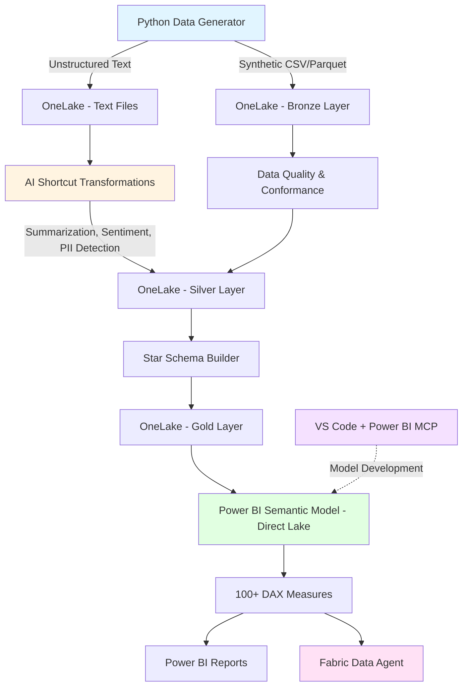

# Microsoft Fabric - Full Enterprise Data Platform Demo

## 🎯 Objective

Comprehensive Microsoft Fabric demo showcasing an **end-to-end enterprise data platform** with:
- **7 integrated business domains** (Sales, HR, Finance, Operations, Customer Service, IT Ops, ESG)
- **17 Gold star schema tables** with 12 relationships
- **42 DAX measures** organized by business domain
- **Medallion Architecture** (Bronze → Silver → Gold)
- **OneLake Shortcuts** + **AI Transformations** on unstructured data
- **Power BI Semantic Model** (Direct Lake) with comprehensive metrics
- **Fabric Data Agent** with multi-domain insights
- **Power BI MCP Server** integration for VS Code development

**Personas:** C-Suite Executives, CDO, Enterprise Architect, Data Platform Team, Business Analysts

---

## 📊 Architecture



---

## 📁 Repository Structure

```
MF_FullCompanyDT/
├── README.md (this file)
├── AGENTS.md (development conventions)
├── requirements.txt (Python dependencies)
│
├── data-gen/ (Synthetic data generation)
│   ├── config.yml (volumes, parameters)
│   ├── generate_all.py (main generator)
│   ├── generators/
│   │   ├── crm_generator.py
│   │   ├── sales_generator.py
│   │   ├── product_generator.py
│   │   ├── marketing_generator.py
│   │   ├── hr_generator.py
│   │   ├── supply_chain_generator.py
│   │   ├── manufacturing_generator.py
│   │   ├── finance_generator.py
│   │   ├── esg_generator.py
│   │   ├── call_center_generator.py
│   │   ├── itops_generator.py
│   │   ├── finops_generator.py
│   │   ├── risk_compliance_generator.py
│   │   ├── rd_generator.py
│   │   └── quality_security_generator.py
│   ├── utils/
│   │   ├── conformed_dimensions.py (shared dimensions)
│   │   ├── data_quality.py (validation)
│   │   └── text_generator.py (unstructured content)
│   └── output/ (generated after execution)
│       ├── structured/ (CSV/Parquet)
│       └── unstructured/ (TXT files)
│
├── docs/
│   ├── demo-script.md (10-15 min walkthrough)
│   ├── data-catalog.md (data dictionary)
│   ├── security-and-governance.md (best practices)
│   └── shortcuts-and-ai-transforms.md (AI demos)
│
├── fabric/
│   ├── lakehouse/
│   │   ├── bronze-mapping.md (source → raw)
│   │   ├── silver-transformations.md (cleaning + conformance)
│   │   └── gold-star-schemas.md (dimensional models)
│   │
│   ├── notebooks/
│   │   ├── 01_ingest_to_bronze.ipynb
│   │   ├── 02_transform_to_silver.ipynb
│   │   ├── 03_build_gold_star_schema.ipynb
│   │   └── 04_quality_checks.ipynb
│   │
│   ├── powerbi/
│   │   ├── semantic-model-spec.md (logical structure)
│   │   ├── dax-measures.md (100+ measures)
│   │   ├── report-pages.md (suggested visualizations)
│   │   └── powerbi-mcp.md (VS Code MCP workflow)
│   │
│   └── data-agent/
│       ├── data-agent-setup.md (configuration guide)
│       ├── agent-instructions.md (system prompts)
│       └── example-questions.md (50+ business questions)
│
└── .gitignore
```

---

## 📊 Data Domains & Volume

### Gold Star Schema Tables (17 tables)

#### Dimension Tables (5)

| Dimension | Description | Key Attributes |
|-----------|-------------|----------------|
| **gold_dimdate** | Time intelligence with fiscal calendar | date_id, year, quarter, month, week, fiscal_year |
| **gold_dimgeography** | Location hierarchy | geography_id, country, region, city, facility |
| **gold_dimcustomer** | Customer master data | customer_id, name, segment, industry, region |
| **gold_dimemployee** | Employee master with org hierarchy | employee_id, name, title, department, manager_id |
| **gold_dimproduct** | Product catalog with categories | product_id, name, category, subcategory, unit_cost |

#### Fact Tables (12)

| Fact Table | Business Domain | Description | Key Metrics |
|------------|----------------|-------------|-------------|
| **gold_factsales** | Sales | Sales transactions | revenue, quantity, discount, gross_margin |
| **gold_factreturns** | Sales | Product returns | return_amount, return_quantity, reason |
| **gold_factopportunities** | Sales | Sales pipeline | opportunity_amount, probability, stage |
| **gold_factattrition** | HR | Employee departures | termination_type, tenure, replacement_cost |
| **gold_facthiring** | HR | Recruitment | time_to_hire, cost_per_hire, source |
| **gold_factincidents** | IT Ops / Customer Service | Support tickets & IT incidents | resolution_time, priority, category |
| **gold_factprojects** | Operations | Project execution | budget, actual_cost, timeline |
| **gold_factproduction** | Operations | Manufacturing metrics | quantity_produced, scrap_rate, oee |
| **gold_factgeneralledger** | Finance | Financial transactions | amount, account, cost_center |
| **gold_factcloudcosts** | IT Ops | Cloud infrastructure costs | cost, service_type, resource_id |
| **gold_factemissions** | ESG | Carbon footprint | emissions_co2e, scope, source |
| **gold_factactivities** | CRM | Customer interactions | activity_type, duration, outcome |

### Business Domains & Scenarios

| Domain | Scenario Document | Key KPIs | Tables Used |
|--------|------------------|----------|-------------|
| **Sales** | scenario-sales.md | Revenue, Gross Margin %, Win Rate | factsales, factreturns, factopportunities |
| **HR** | scenario-hr.md | Attrition Rate, Time to Hire | factattrition, facthiring |
| **Finance** | scenario-finance.md | EBITDA Margin, Budget Variance | factgeneralledger |
| **Operations** | scenario-operations.md | OEE, Scrap Rate, MTBF | factproduction, factincidents |
| **Customer Service** | scenario-customer-service.md | CSAT, FCR, Resolution Time | factincidents |
| **IT Ops** | scenario-it-ops.md | System Availability, MTTR, Cloud Costs | factincidents, factcloudcosts |
| **ESG** | scenario-esg.md | Carbon Emissions, Renewable Energy % | factemissions |

**Total Volume:** ~4.2M structured records + 5,000+ text files

---

## 🚀 Quick Start

### 1. Generate Synthetic Data

```bash
# Install dependencies
pip install -r requirements.txt

# Generate all domains (takes ~5-10 minutes)
cd data-gen
python generate_all.py

# Output: data-gen/output/structured/*.csv and unstructured/*.txt
```

### 2. Deploy to Microsoft Fabric

See [docs/demo-script.md](docs/demo-script.md) for step-by-step walkthrough:

1. **Create Fabric Workspace** (Premium capacity required)
2. **Create Lakehouse** → Upload CSV files to Bronze layer
3. **Run Notebooks** → Transform Bronze → Silver → Gold
4. **Create OneLake Shortcuts** → Link to text files
5. **Apply AI Transformations** → Sentiment, Summarization, PII Detection
6. **Build Semantic Model** → Direct Lake on Gold tables
7. **Create DAX Measures** → Import from [dax-measures.md](fabric/powerbi/dax-measures.md)
8. **Configure Data Agent** → Select 5-7 key tables, add instructions
9. **Test Natural Language Queries** → Use example questions

### 3. Power BI MCP Development (VS Code)

See [fabric/powerbi/powerbi-mcp.md](fabric/powerbi/powerbi-mcp.md):

1. Install **Power BI Modeling MCP Server** extension
2. Connect to semantic model (Desktop / Fabric / PBIP)
3. Use Copilot Chat for:
   - Creating relationships
   - Generating DAX measures
   - Bulk renaming
   - Adding descriptions/synonyms
   - Validating queries

---

## 🎯 Demo Scenarios

### Scenario 1: OneLake Shortcuts + AI Transformations (5 min)

**Objective:** Show how unstructured data (call center emails) becomes query-ready

1. Navigate to OneLake → Show text files in `unstructured/callcenter_emails/`
2. Create OneLake Shortcut → Select folder
3. Apply AI Transformations:
   - Sentiment Analysis
   - Summarization
   - PII Detection (email masking demo)
4. Query the transformed Delta table → Join with structured tickets

**Key Message:** "Unstructured data becomes structured insights automatically"

### Scenario 2: Multi-Domain Analytics with Data Agent (10 min)

**Objective:** Answer complex business questions across domains

**Example Questions:**
- "What drove the revenue drop in EMEA last month and does it correlate with supply delays?"
- "Summarize top customer complaints by product line and link to quality defects"
- "Explain attrition hotspots by manager and impact on delivery SLAs"

**Key Message:** "Data Agent connects the dots across your entire enterprise"

### Scenario 3: Power BI MCP - Model Development in VS Code (10 min)

**Objective:** Show rapid semantic model development

1. Open VS Code → Connect to semantic model
2. Use Copilot Chat:
   - "Create all star schema relationships between Fact_Sales and dimensions"
   - "Generate YTD, QTD, and MoM measures for Revenue"
   - "Add descriptions and synonyms to all tables for AI readiness"
   - "Validate this DAX: CALCULATE(SUM(Sales[Amount]), DATEADD(...))"

**Key Message:** "Build enterprise-grade models faster with AI assistance"

---

## 📊 Key Features Demonstrated

### OneLake
- ✅ Unified data lake across all domains
- ✅ Bronze/Silver/Gold medallion architecture
- ✅ Shortcuts to external data sources
- ✅ Delta Lake format for ACID transactions

### AI Transformations
- ✅ Sentiment analysis on customer feedback
- ✅ Summarization of support tickets
- ✅ PII detection and masking
- ✅ Named entity recognition (products, people, orgs)
- ✅ Translation (multi-language support tickets)

### Power BI Semantic Model
- ✅ Direct Lake mode (no data duplication)
- ✅ 15+ fact tables with conformed dimensions
- ✅ 100+ pre-built DAX measures (Revenue, Margin, Inventory Turns, Attrition, CSAT, Emissions, etc.)
- ✅ Row-level security (RLS) templates
- ✅ AI-ready metadata (descriptions, synonyms)

### Fabric Data Agent
- ✅ Natural language queries across domains
- ✅ Context-aware responses (uses semantic model metadata)
- ✅ Multi-step reasoning (e.g., "Why did X happen? → Analyze Y and Z")
- ✅ Verified answers configuration

### Power BI MCP Server (VS Code)
- ✅ Model exploration and navigation
- ✅ Relationship creation (bulk operations)
- ✅ DAX measure generation (YTD, QTD, MoM, etc.)
- ✅ Naming conventions enforcement
- ✅ DAX query validation and testing

---

## 🔒 Security & Governance

See [docs/security-and-governance.md](docs/security-and-governance.md) for detailed guidance:

- **Data Sensitivity Classification** (Public, Internal, Confidential)
- **Row-Level Security (RLS)** templates for regions/departments
- **Column-Level Security (CLS)** for PII fields
- **Domain Separation** (separate workspaces per domain in production)
- **Naming Conventions** (snake_case for tables, PascalCase for measures)
- **Lineage Tracking** (automatic in Fabric)

---

## 📚 Documentation Index

| Document | Purpose |
|----------|---------|
| [demo-script.md](docs/demo-script.md) | Step-by-step demo walkthrough (10-15 min) |
| [data-catalog.md](docs/data-catalog.md) | Complete data dictionary (all tables, columns, relationships) |
| [security-and-governance.md](docs/security-and-governance.md) | Best practices for production deployment |
| [shortcuts-and-ai-transforms.md](docs/shortcuts-and-ai-transforms.md) | Detailed guide for AI transformations |
| [semantic-model-spec.md](fabric/powerbi/semantic-model-spec.md) | Semantic model structure (tables, relationships) |
| [dax-measures.md](fabric/powerbi/dax-measures.md) | 100+ DAX measures organized by domain |
| [report-pages.md](fabric/powerbi/report-pages.md) | Suggested Power BI report layouts |
| [powerbi-mcp.md](fabric/powerbi/powerbi-mcp.md) | VS Code MCP workflow with 10 example prompts |
| [data-agent-setup.md](fabric/data-agent/data-agent-setup.md) | Data Agent configuration guide |
| [agent-instructions.md](fabric/data-agent/agent-instructions.md) | System prompts for Data Agent |
| [example-questions.md](fabric/data-agent/example-questions.md) | 50+ business questions across domains |

---

## 🎓 Learning Paths

### For Data Engineers
1. Run data generation scripts → Understand synthetic data patterns
2. Execute Fabric notebooks → Learn medallion transformations
3. Explore AI transformations → Understand unstructured data processing

### For Analytics Engineers
1. Review semantic model spec → Understand star schema design
2. Study DAX measures → Learn calculation patterns
3. Try Power BI MCP → Accelerate model development

### For Business Analysts
1. Read demo script → Understand business scenarios
2. Test Data Agent questions → Learn natural language querying
3. Explore Power BI reports → Discover insights

---

## 🛠️ Technical Requirements

- **Python 3.9+** (for data generation)
- **Microsoft Fabric Workspace** (Premium capacity: F64 or higher recommended)
- **Power BI Desktop** (latest version) or Fabric Power BI service
- **VS Code** with Power BI Modeling MCP Server extension (optional)
- **~10GB storage** for generated data and Delta tables

---

## 🤝 Contributing

This repository follows the conventions defined in [AGENTS.md](AGENTS.md):
- Use clear, descriptive variable names
- Add inline comments for complex logic
- Update documentation when changing data schemas
- Test data quality after modifications

---

## 📄 License

This is a demo/sample project for Microsoft Fabric. All data is synthetic and generated for demonstration purposes only.

---

## 📞 Support

For questions or issues:
- Review the [docs/](docs/) folder for detailed guides
- Check [AGENTS.md](AGENTS.md) for development conventions
- Consult [fabric/data-agent/example-questions.md](fabric/data-agent/example-questions.md) for inspiration

---

## ✨ What Makes This Demo Special?

1. **Comprehensive Coverage:** 15+ domains = realistic enterprise complexity
2. **Conformed Dimensions:** Demonstrates data governance at scale
3. **Structured + Unstructured:** Shows AI value on text data
4. **End-to-End:** From data generation to natural language insights
5. **Developer Experience:** VS Code MCP integration for rapid development
6. **Production-Ready Patterns:** RLS, CLS, naming conventions, quality checks

**Ready to explore the future of enterprise data platforms? Start with [docs/demo-script.md](docs/demo-script.md) 🚀**
